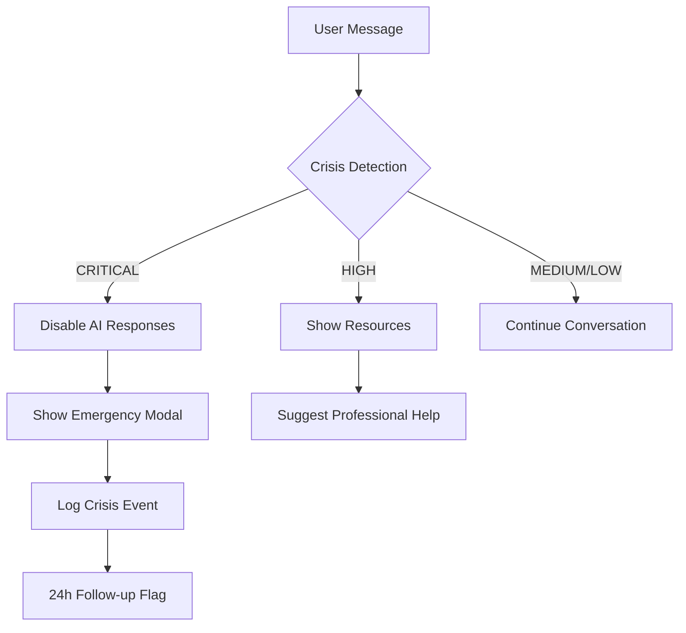

# 🧠 AI Therapist Enhanced - Mental Wellness Assistant

<div align="center">
  
[](https://github.com/yourusername/ai-therapist-enhanced)
[](https://github.com/yourusername/ai-therapist-enhanced)
[](LICENSE)
[](https://nextjs.org)
[](https://www.typescriptlang.org/)

</div>

## ⚠️ AVISO IMPORTANTE / IMPORTANT NOTICE

**PT-BR:** Este é um assistente de bem-estar baseado em IA, **NÃO** um substituto para terapia profissional. Se você está em crise, procure ajuda imediata:
- 🇧🇷 Brasil: CVV 188 (24h) | SAMU 192
- 🇺🇸 USA: 988 Suicide & Crisis Lifeline

**EN:** This is an AI-based wellness assistant, **NOT** a replacement for professional therapy. If you're in crisis, seek immediate help:
- 🇺🇸 USA: 988 Suicide & Crisis Lifeline | 911
- 🇧🇷 Brazil: CVV 188 (24h) | SAMU 192

## 📋 Table of Contents

- [Features](#-features)
- [Security & Compliance](#-security--compliance)
- [Tech Stack](#-tech-stack)
- [Installation](#-installation)
- [Configuration](#-configuration)
- [Usage](#-usage)
- [API Documentation](#-api-documentation)
- [Safety Protocols](#-safety-protocols)
- [Contributing](#-contributing)
- [License](#-license)

## ✨ Features

### Core Functionality
- 🤖 **AI-Powered Conversations** - Empathetic responses using Google Gemini or OpenAI
- 🛡️ **Crisis Detection System** - Multi-level crisis detection with emergency resources
- 🔐 **End-to-End Encryption** - AES-256 encryption for all sensitive data
- 📊 **Mood Tracking** - Track emotional patterns over time
- 🎯 **Evidence-Based Techniques** - CBT, DBT, Mindfulness, ACT
- 🌍 **Multi-Language Support** - Portuguese (BR) and English (US)
- 📱 **Responsive Design** - Works on all devices
- 🌓 **Dark/Light Mode** - User preference support

### Safety Features
- ⚡ **Real-time Crisis Detection** - Immediate intervention for high-risk situations
- 📞 **Emergency Resources** - Quick access to crisis hotlines
- 🚨 **Safety Protocols** - Automated crisis response system
- 👤 **Anonymous Sessions** - Option to use without registration
- 📝 **Legal Disclaimers** - Clear boundaries and limitations
- 🔍 **Audit Logging** - HIPAA-compliant activity tracking

### Privacy & Compliance
- 🔒 **Data Encryption** - All sensitive data encrypted at rest and in transit
- 📜 **LGPD/GDPR Compliant** - Full compliance with privacy regulations
- 🗑️ **Auto Data Deletion** - Configurable retention policies
- 🔑 **Secure Authentication** - NextAuth with 2FA support
- 📊 **Minimal Data Collection** - Only essential data stored
- 🎭 **Anonymization Options** - Use without providing personal info

## 🔒 Security & Compliance

### Data Protection
- **Encryption**: AES-256-GCM for data at rest
- **Transport Security**: TLS 1.3 for all connections
- **Session Management**: Secure, httpOnly, sameSite cookies
- **Password Security**: bcrypt with salt rounds
- **API Security**: Rate limiting and CORS protection

### Compliance Standards
- ✅ **LGPD** (Lei Geral de Proteção de Dados - Brazil)
- ✅ **GDPR** (General Data Protection Regulation - EU)
- ✅ **COPPA** (Children's Online Privacy Protection - US)
- ⚠️ **HIPAA** (Partial - requires additional configuration)

### Privacy Features
- User consent management
- Right to erasure (delete all data)
- Data portability (export user data)
- Privacy by design architecture
- Minimal data retention (30 days default)

## 🛠 Tech Stack

### Frontend
- **Framework**: Next.js 14 (App Router)
- **Language**: TypeScript 5
- **Styling**: Tailwind CSS + Framer Motion
- **UI Components**: Radix UI
- **State Management**: Zustand
- **Forms**: React Hook Form + Zod

### Backend
- **Runtime**: Node.js 20+
- **Database**: MongoDB with Prisma ORM
- **Authentication**: NextAuth.js
- **AI Integration**: Google Gemini / OpenAI API
- **Encryption**: CryptoJS (AES-256)

### DevOps & Monitoring
- **Hosting**: Vercel / AWS
- **Monitoring**: Sentry
- **Analytics**: Google Analytics 4
- **CI/CD**: GitHub Actions

## 📦 Installation

### Prerequisites
- Node.js 20.0.0 or higher
- MongoDB Atlas account (or local MongoDB)
- Google Gemini API key (or OpenAI API key)
- Git

### Step 1: Clone the Repository
```bash
git clone https://github.com/yourusername/ai-therapist-enhanced.git
cd ai-therapist-enhanced
```

### Step 2: Install Dependencies
```bash
npm install
# or
yarn install
# or
pnpm install
```

### Step 3: Set Up Environment Variables
```bash
# Copy the example env file
cp .env.example .env.local

# Edit .env.local with your values
nano .env.local
```

### Step 4: Set Up Database
```bash
# Generate Prisma client
npx prisma generate

# Push schema to MongoDB
npx prisma db push

# (Optional) Seed the database
npm run db:seed
```

### Step 5: Run the Development Server
```bash
npm run dev
# or
yarn dev
# or
pnpm dev
```

Visit [http://localhost:3000](http://localhost:3000) to see the application.

## ⚙️ Configuration

### Essential Environment Variables

```env
# Database (Required)
DATABASE_URL="your-mongodb-connection-string"

# Authentication (Required)
NEXTAUTH_SECRET="generate-a-secure-32-char-min-secret"
NEXTAUTH_URL="http://localhost:3000"

# AI Provider (Choose one)
GOOGLE_GEMINI_API_KEY="your-gemini-key"
# OR
OPENAI_API_KEY="your-openai-key"

# Encryption (Required - Generate secure keys!)
ENCRYPTION_MASTER_KEY="generate-256-bit-key-base64"

# Crisis Detection (Recommended)
ENABLE_CRISIS_DETECTION="true"
CRISIS_WEBHOOK_URL="your-monitoring-webhook"
```

### Generating Secure Keys

```bash
# Generate encryption keys
node -e "console.log(require('crypto').randomBytes(32).toString('base64'))"

# Generate NextAuth secret
openssl rand -base64 32
```

### AI Safety Settings

```env
AI_TEMPERATURE="0.7"        # Lower = more conservative
AI_MAX_TOKENS="1000"        # Limit response length
AI_SAFETY_FILTER="strict"   # strict, moderate, none
```

## 🚀 Usage

### For Users

1. **First Visit**: Read and accept the legal disclaimers
2. **Choose Session Type**: Anonymous or registered user
3. **Start Chatting**: Share your thoughts and feelings
4. **Use Tools**: Try breathing exercises, mood tracking
5. **Emergency**: Crisis resources are always one click away

### For Developers

#### Project Structure
```
ai-therapist-enhanced/
├── app/                    # Next.js app router
│   ├── api/               # API routes
│   ├── dashboard/         # User dashboard
│   └── therapy/           # Therapy chat interface
├── components/
│   ├── safety/           # Crisis detection, disclaimers
│   ├── therapy/          # Chat components
│   └── ui/               # Reusable UI components
├── lib/
│   ├── ai/               # AI prompts and integration
│   ├── api/              # API client functions
│   ├── security/         # Encryption, crisis detection
│   └── utils/            # Utility functions
├── prisma/
│   └── schema.prisma     # Database schema
└── public/               # Static assets
```

#### Key Components

```typescript
// Crisis Detection Usage
import { getCrisisDetector } from '@/lib/security/crisis-detection';

const detector = getCrisisDetector('pt-BR');
const analysis = detector.analyzeMessage(userMessage);

if (analysis.level === 'CRITICAL') {
  // Trigger emergency protocol
}
```

```typescript
// Encryption Usage
import { getEncryption } from '@/lib/security/encryption';

const encryption = getEncryption();
const encrypted = encryption.encrypt(sensitiveData);
const decrypted = encryption.decrypt(encrypted);
```

## 📚 API Documentation

### Authentication Endpoints
- `POST /api/auth/register` - User registration
- `POST /api/auth/login` - User login
- `POST /api/auth/logout` - User logout
- `GET /api/auth/session` - Get current session

### Therapy Endpoints
- `POST /api/therapy/session` - Create new therapy session
- `POST /api/therapy/message` - Send message to AI
- `GET /api/therapy/history` - Get session history
- `POST /api/therapy/mood` - Log mood entry

### Safety Endpoints
- `POST /api/crisis/detect` - Analyze message for crisis
- `GET /api/crisis/resources` - Get emergency resources
- `POST /api/crisis/report` - Report crisis event

## 🚨 Safety Protocols

### Crisis Detection Levels

| Level | Triggers | Action |
|-------|----------|--------|
| **CRITICAL** | Suicidal ideation, self-harm plans | Immediate intervention, disable AI, show emergency resources |
| **HIGH** | Hopelessness, severe depression | Suggest professional help, provide crisis resources |
| **MEDIUM** | Anxiety, sadness, stress | Offer coping strategies, monitor closely |
| **LOW** | Normal conversation | Continue supportive dialogue |

### Emergency Protocol Flow



## 🤝 Contributing

We welcome contributions! Please see our [Contributing Guide](CONTRIBUTING.md) for details.

### Development Guidelines
1. **Security First**: All PRs must pass security review
2. **Test Coverage**: Maintain >80% test coverage
3. **Documentation**: Update docs for new features
4. **Accessibility**: WCAG 2.1 AA compliance
5. **i18n**: Support both pt-BR and en-US

### Code of Conduct
This project adheres to a [Code of Conduct](CODE_OF_CONDUCT.md). By participating, you agree to uphold this code.

## 📄 License

This project is licensed under the MIT License - see the [LICENSE](LICENSE) file for details.

## 🙏 Acknowledgments

- Crisis detection patterns based on research from [Citation Needed]
- CBT/DBT techniques adapted from [Citation Needed]
- Security best practices from OWASP

## 📞 Support

- **Technical Issues**: [GitHub Issues](https://github.com/yourusername/ai-therapist-enhanced/issues)
- **Security Concerns**: security@yourdomain.com
- **Crisis Support**: 
  - 🇧🇷 CVV: 188
  - 🇺🇸 988 Lifeline

---

<div align="center">
  
**Remember**: This tool is designed to support, not replace, professional mental health care.
  
Made with ❤️ and 🧠 for mental wellness

</div>
